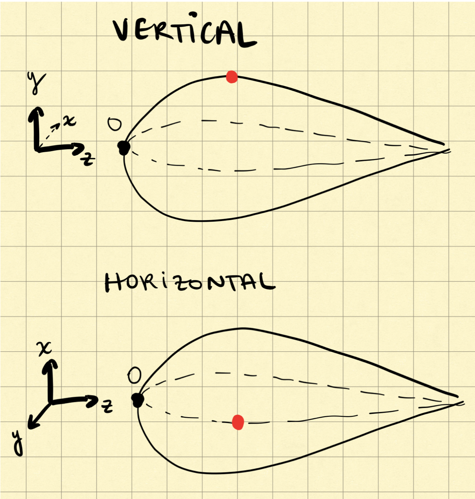

## Making a Hull Profile in Solidworks

### Choosing Airfoils

First you will need to go to [http://airfoiltools.com](http://airfoiltools.com){:target="_blank"} to choose airfoils (best page ever). 

Here is a helpful diagram of an airfoil with all of the relevant nomenclature!

Change the number of points to 200 to generate a more precise curve.

Important considerations:

* We will make a very design theory technical wiki in the future addressing which airfoils to choose and how to compare the graphs at the bottom of the airfoiltools pages
* We will only use symmetrical airfoils, which means you want a flat camber line. (max camber = 0)
* You need a vertical and a horizontal profile.
* We will use this orientation convention - with the front of the submarine at the origin: see picture below

### Importing Data into MATLAB (or Excel)

#### Excel Instructions
* The data we need from this site can be found in the "Dat file" element at the top. Copy both columns into excel starting from the zero entries.
* Copy paste the coordinates from airfoiltools.com into Excel.
* Be sure to label your separate columns! Color coding might also be helpful.
* Make sure your coordinates are in separate columns.
* Because the data provided on the site in in 2D, you will need to add a column of zeroes to make it 3D. So add the extra dimensions according to our convention! This means the vertical profile needs an x column of 0, and the horizontal profile requires a y column of 0s.
* Notice that airfoiltools gives you the top and bottom curve in succession; they are separated by a blank row in the middle of each x and y column.
* Manually add bookend curves with (0 0 0) and (0 0 1) so that the separate curves meet in those points. It's ideal to have the same number of points for the curves, and avoid duplicate points within the same curve.

#### Matlab Instructions
WIP. Eventually we might make a Matlab script to do this.

### Scaling

Airfoiltools gives all of their curves to a length of 1.
Be sure to keep your old columns of coordinates separate, and label the scaled ones accordingly.

Scale the curves to the desired height, width and length. Keep in mind that we are using inches for units - be careful of the units of your Solidworks part.
Additionnally, note that if you scale the upper and lower curve by 2, you are making 4 times bigger altogether.

Scale the length first - just multiply by the number of inches of the desired submarine. Our past hulls have been around 120 inches long.

To set the max height, find the largest y coordinate on the vertical curve, and determine the scaling factor.

Design Considerations:
* pilot's height
* pilot's shoulder width
* Maximum length

Click the increase decimal button (so that it adds zeroes accordingly to the end). (see picture)

### Importing Curves into SolidWorks

* Open a new Solidworks part.
* Set your file to IPS (inches, pounds, seconds)
* Rename the base planes to display xy, yz and xz (for your convenience)

* Export your curves to text files. Make sure the columns all line up. Name them accordingly.
* In the Top Ribbon, click Insert > Curve > from Curve Through xyz Points. (see screenshot)
* Click Browse and choose the appropriate text file. Make sure that the columns are separated correctly. Press ok.
* Name your curve as you import them like "xy top curve" for example.

Repeat these 4 steps for 3 of the curves. We can mirror the profile to obtain the last curve by symmetry.

### Lofting

* Make a reference plane (see picture) using a base plane and offset distance (this distance can be arbitrary).
* Name the plane specifying the base plane and offset distance like "yz-10in-pln".
* Make a Sketch on that plane
* Make a Spline through the 3 points that intersect that plane.

LOFTED BOSS/BASE
- Need profiles and guide curve

Then, you can make a spline at an arbitrary distance from the front of the sub, and use that as a guiding curve to loft the submarine into existence.
